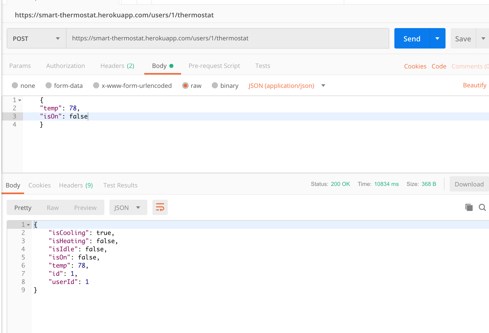
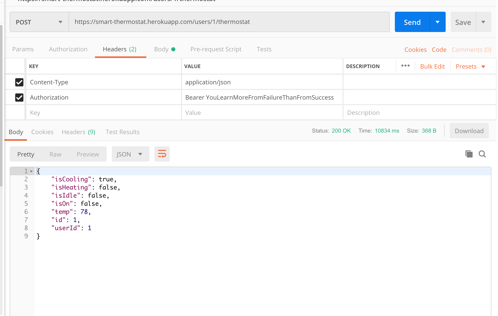

# Smart Thermostat

## User Verification

- User needs a code to sign-up/join (This can be a hard coded arbitrary string “1234567”)
- User completes sign up with email and password

## Functions

- Set setpoint temperature
- Set heating, cooling, off, or auto
- Display room temperature
- Display status (Heating, Cooling, Idle)

## API

- One API endpoint to adjust temperature.
- Auth via token (again, can be hardcoded string)
- Temperature adjustment should be reflected on the front end.
- Spec Sheet (NOT A SHOLE SHEET) for the endpoint and how a user can interact with it.

## Setup and Usage

- git clone https://github.com/darwin911/thermostat-api
- create a database `thermostat`
- in root directory `npm i`, `node server` or `npm run dev` (development)
- navigate to client directory `cd client`
- run `npm i` and `npm start`

- Register with verification code : `ilovebikes`

- `https://smart-thermostat.herokuapp.com/users/:user_id/thermostat/`

## **Smart Thermostat API**

- **URL**

  /users/:user_id/thermostat/

- **Method:**

  `GET`
  You can use the `GET` route by calling with the correct user id and will return the current state of that users thermostat.

  `POST`
  For the `POST` route you need to pass an object (refereced below) with the setting you'd like to change.

- **URL Params**

  `:user_id`

  This URL param will be set by the front end.

- **Request Body **

  the request body should look like this, depending on which setting the user is setting 
  ```
  {
    temp: 90,
    isHeating: false,
    isCooling: true,
    isIdle: false,
    isOn: true,
  }
  ```

  

  Headers need to be set as follows: 

  Authorization: Bearer 
  

- **Sample Call:**

  ```
  POST /users/1/thermostat

      {
        temp: 78,
        isOn: false
      }
  ```

  returns

  ```
    thermostat: {
      cooling: true
      createdAt: "2019-06-03T00:35:58.821Z"
      heating: false
      id: 1
      idle: false
      on: false
      temperature: 78
      updatedAt: "2019-06-03T20:34:50.250Z"
      userId: 1
    }
  ```
